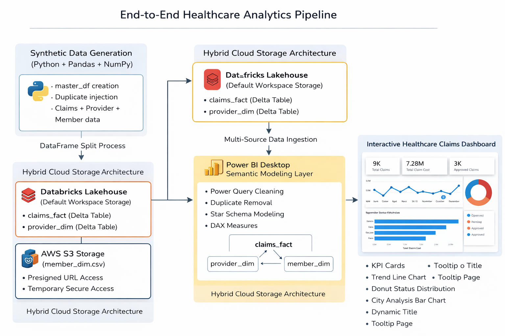
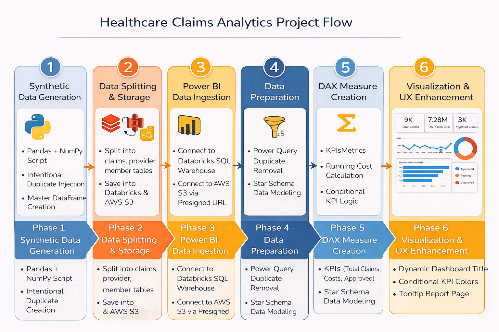
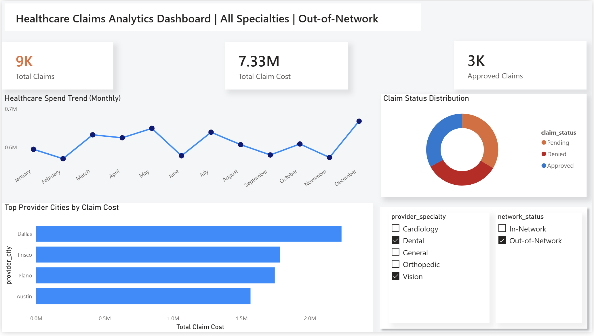

# 🏥 Healthcare Claims Analytics Platform

### End-to-End Data Engineering + Analytics Project (Databricks • AWS S3 • Power BI)


An end-to-end healthcare analytics solution designed to simulate real-world insurance claim processing workflows.
This project demonstrates modern **data engineering**, **data modeling**, and **interactive business intelligence** practices using cloud and analytics tools.

---

## 🚀 Project Overview

Healthcare organizations generate massive claim datasets that require:

* Data ingestion
* Cleaning & validation
* Dimensional modeling
* Analytical visualization

This project builds a scalable analytics pipeline where raw healthcare claim data is processed using **Databricks**, stored across **Databricks Storage & AWS S3**, modeled into a **Star Schema**, and visualized using **Power BI**.

The final result is an **interactive healthcare dashboard** that enables users to explore claim trends, provider performance, and approval distribution.

---

## 🎯 Problem Statement

Healthcare analytics teams struggle with:

* Disconnected data sources
* Poor data modeling
* Static reports with limited interaction
* Lack of scalable data pipelines

The goal was to design a **modern analytics workflow** that mimics enterprise-level healthcare reporting systems.

---

## 🎯 Objectives

* Build a realistic healthcare claims dataset using Python
* Simulate cloud-based storage using Databricks & AWS S3
* Implement dimensional modeling using Star Schema
* Create interactive analytics dashboards in Power BI
* Demonstrate data engineering + BI integration skills

---

## 📈 Business Impact

This dashboard enables healthcare stakeholders to:

* Monitor claim approval vs denial trends
* Identify high-cost provider regions
* Track monthly healthcare spending behavior
* Analyze network utilization patterns
* Support data-driven operational decisions

The project simulates real-world insurance analytics workflows used by healthcare payers.

---

## 🧱 Architecture Overview



### Architecture Flow

Python (Databricks) → Data Processing → Cloud Storage → Power BI → Interactive Dashboard

**Data Sources**

* Databricks Default Storage
* AWS S3 (member dimension table)

---

## 🔄 Project Flow



1. Synthetic healthcare data generation using Pandas & NumPy
2. Master dataset split into Fact and Dimension tables
3. Storage across Databricks & AWS S3
4. Data ingestion into Power BI
5. Data cleaning & transformation
6. Star Schema modeling
7. DAX measure creation
8. Interactive dashboard design

---

## 🧹 Data Quality & Governance

To simulate real-world analytics challenges:

* Duplicate records were intentionally introduced
* Power BI transformations were used to clean data
* Validation steps ensured accurate KPI calculations

This demonstrates real-world data preparation workflows before analytics modeling.

---

## 🛠️ Tech Stack

| Layer            | Tools Used            | Purpose                           |
| ---------------- | --------------------- | --------------------------------- |
| Data Engineering | Python, Pandas, NumPy | Data generation & transformation  |
| Cloud Processing | Databricks            | Data engineering workspace        |
| Cloud Storage    | AWS S3                | External data source integration  |
| Data Modeling    | Power BI Model View   | Star Schema implementation        |
| Analytics        | Power BI Desktop      | Interactive visualization         |
| Query Language   | DAX                   | KPI calculations & dynamic titles |

---

## 🏗️ Architectural Design Decisions

* **Databricks** simulates enterprise-scale data processing
* **AWS S3** demonstrates multi-cloud integration
* **Power BI** provides strong data modeling + visualization
* **DAX** enables dynamic analytics logic

This combination reflects real-world data platform architectures.

---

## 📊 Dashboard Features

* Dynamic KPI cards
* Claim status distribution
* Monthly healthcare spend trends
* Provider city performance analysis
* Interactive slicers (Provider Specialty, Network Status)
* Dynamic dashboard header using DAX
* Custom Tooltip Pages

### Dashboard Preview



---

## 🧪 Data Modeling

A Star Schema was implemented:

**Fact Table**

* `claims_fact`

**Dimension Tables**

* `provider_dim`
* `member_dim`

Relationships created in Power BI Model View to simulate enterprise warehouse modeling.

---

## ⚙️ Key DAX Measures

Examples include:

* Total Claims
* Total Claim Cost
* Running Cost
* Approved Claims
* Dynamic Dashboard Title

---

## 🌐 Published Interactive Dashboard

👉 https://app.powerbi.com/view?r=eyJrIjoiNDVhMjExNzctYTU5YS00YTk3LWIzNmQtODk0ZTJjODUyOTQ4IiwidCI6IjcwZGUxOTkyLTA3YzYtNDgwZi1hMzE4LWExYWZjYmEwMzk4MyIsImMiOjN9

⚠️ Note: This is a public demo environment using synthetic healthcare data.

---

## 🚀 Deployment

The dashboard is deployed using Power BI Service.

Deployment Steps:

* Published report from Power BI Desktop
* Hosted in Power BI Service (Cloud)
* Embedded public link for interactive viewing

This simulates production BI deployment workflows.

---

## 📁 Repository Structure

```
Healthcare-Claims-Analytics-Project/
│
├── README.md
│
├── architecture/
│   ├── architecture_diagram.png
│   └── project_flow_diagram.png
│
├── notebooks/
│   └── healthcare_data_generation.ipynb
│
├── powerbi/
│   └── healthcare_claims_dashboard.pbix
│
├── documentation/
│   └── Healthcare_Claims_Analytics_Project_Documentation.docx
│
└── images/
    └── dashboard_preview.png
```

---

## 🧠 Skills Demonstrated

### 🔹 Data Engineering & Cloud Integration

* Synthetic healthcare data generation using Python (Pandas, NumPy)
* Hybrid cloud architecture using Databricks and AWS S3
* Multi-source data ingestion into Power BI
* Secure data access using presigned URLs

### 🔹 Data Modeling & Analytics

* Star Schema dimensional modeling
* Fact and Dimension table design
* Relationship optimization for performance
* DAX measure development for KPIs and analytics logic

### 🔹 Power BI Advanced Features

* Dynamic dashboard titles using DAX
* Custom Tooltip Report Pages
* Conditional KPI formatting
* Interactive slicers and cross-filtering
* Professional UI/UX dashboard design

### 🔹 Business Intelligence & Visualization

* Healthcare claims trend analysis
* Provider performance insights
* Network utilization analytics
* Data storytelling through interactive visuals

### 🔹 Development & Deployment

* Databricks Notebook development
* Power BI Service publishing
* GitHub project structuring
* Documentation and architecture design
